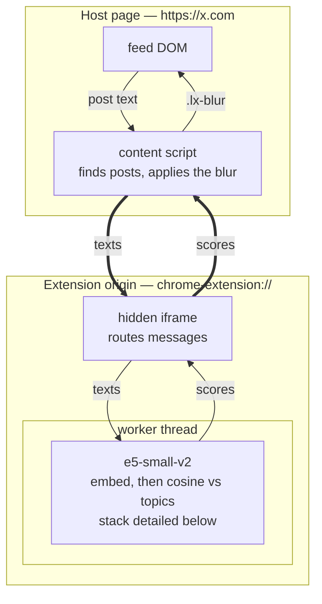
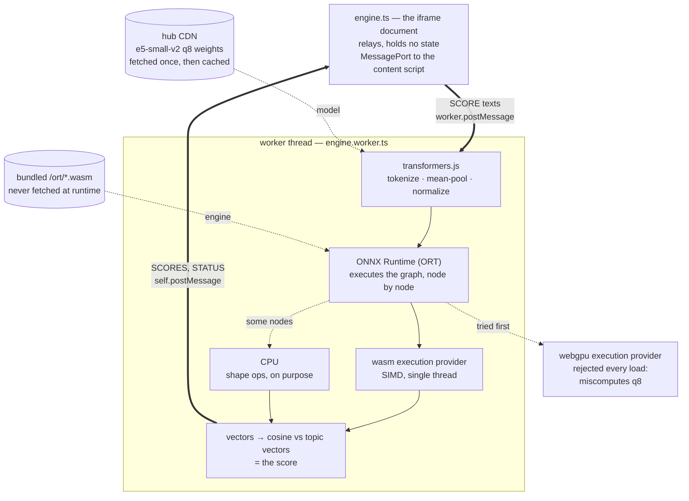

# Lensing

[](https://github.com/juliomatcom/lensing/actions/workflows/ci.yml)

Pick your topics. Everything else in your feed gets blurred — still there, one
click away. The model runs entirely on your device; no post text ever leaves it.

Chrome and Firefox, MV3, no backend.

## Requirements

Node 20+ and npm. Nothing else — the ONNX runtime is copied out of
`node_modules` on install, and the model downloads itself on first use.

```bash
npm install
```

## Run it

```bash
npm run watch            # build on change -> .output/chrome-mv3
```

Then load the build and hit reload in the browser after each rebuild.

```bash
npm run build            # one-off -> .output/chrome-mv3 and .output/firefox-mv3
npm run build:firefox    # one-off, Firefox only -> .output/firefox-mv3
```

### Why not `npm run dev`

WXT's dev server serves entrypoint modules from `http://localhost:3001`. The
engine page then creates its worker from that origin, which is **cross-origin to
the extension**, so `new Worker()` throws and the engine never starts — silently,
because nothing else fails. `npm run watch` produces a real production build on
every change instead. Slower by about a second, and it actually runs.

`npm run dev` is still useful for popup-only work, where no worker is involved.

**Chrome** — `chrome://extensions`, turn on Developer mode, _Load unpacked_,
pick `.output/chrome-mv3`.

**Firefox** — `about:debugging#/runtime/this-firefox`, _Load Temporary Add-on_,
pick `.output/firefox-mv3/manifest.json`.

**Firefox for Android** — see [`docs/android.md`](docs/android.md); it needs
Nightly on both ends and a different loading path.

Then open the toolbar popup, add a topic (`tech, software, ai` — one per line),
and visit x.com.

### Watching it work

Every layer logs to the console, prefixed `[lensing:*]`. Post text is never
logged — counts, scores, states and errors only.

```
[lensing:content] content script started host=x.com adapter=x topics=1 active=true
[lensing:client]  injecting engine iframe src=chrome-extension://.../engine.html
[lensing:engine]  engine page loaded origin=chrome-extension://...
[lensing:worker]  loading model
[lensing:worker]  ready backend=wasm
[lensing:worker]  scored posts=16 msPerPost=12 max=0.244
[lensing:content] batch applied posts=16 blurred=13 strictness=0.06
```

WebGPU is tried first and rejected by the self-check on the way past — ORT
miscomputes the q8 weights there — so `backend=wasm` is the expected steady
state, and the rejection prints at `info`, not as a warning.

The first missing line locates the failure. `content` and `client` lines appear in
the page console; `engine` and `worker` lines come from the iframe, so pick the
`engine.html` context in the devtools frame selector to see them.

Logging is on while `VITE_LENSING_DEBUG=1` is set in `.env`. Turn it off before
any store submission.

### First run

The model is ~33MB and downloads once, then lives in the browser's cache.
Nothing blurs until it is loaded: a broken or slow engine always reveals rather
than leaving you with a blurred wall. Check the popup's status dot to see where
it is.

## Test

```bash
npm test                 # unit tests, no browser, no network
npm run test:watch
npm run compile          # tsc --noEmit
```

Full check before committing:

```bash
npm run format:check && npm run compile && npm test && npm run build
```

```bash
npm run test:model       # the real model on real feed text, ~3s
```

Tests never touch the network or a live feed. Site adapters run against captured
fixture HTML, because vendor DOM changes should fail as a red test rather than a
silent no-op in production.

What no test covers: model loading, WebGPU init, and real scoring in a browser.
A green suite is not a working extension — load a build and watch the popup
status. See [`wiki-llm/testing.md`](wiki-llm/testing.md).

## Layout

```
src/
  ml/          the model, scoring (pure), and the only transformers.js import
  core/        message protocol, score cache, settings, logging
  adapters/    per-site DOM knowledge; X today
  content/     host-page logic: blur controller, engine client
  entrypoints/ content script, engine iframe + worker, background, popup
  ui/          blur stylesheet
public/ort/    ONNX runtime, synced from node_modules by scripts/sync-ort.mjs
wiki-llm/      source of truth
specs/         superseded design docs, provenance only
```

Inference runs in a hidden extension-origin iframe — not the page, not the
service worker. `wiki-llm/architecture.md` explains why that is the only
portable option.

## How it works



Three layers, each for one reason. The **content script** lives inside the page,
so it is the only part that can read the feed or blur anything. The **iframe**
exists because a content script cannot spawn an extension-origin worker, but a
document already on that origin can. The **worker** is a separate thread, so
scoring never blocks scrolling.

The iframe never sees the page: strings go in, scores come out. That boundary is
what keeps post text on your device, and it is why the model layer knows nothing
about X.

### Inside the worker

"Embed" is four pieces of machinery, and the console lines on a cold start come
from three different ones — so it is worth knowing which is which. The thick
edges are the same `texts` / `scores` pair the first diagram draws, seen from the
other side of the worker boundary.



**ONNX** is the model's file format — graph plus weights, framework-independent.
**ORT** is Microsoft's engine that executes it, and an **execution provider** is a
backend ORT can hand an operation to. Assignment is per operation, not per model:
ORT deliberately keeps shape ops on CPU because moving them costs more than they
save. That is all its `VerifyEachNodeIsAssignedToAnEp` line means, which is why
the runtime is configured to log errors only.

The two supply lines are deliberately different. **Weights** come from the hub CDN
on first load and live in the browser cache after that. The **runtime WASM** is
bundled in the extension and never fetched — remote WASM is reviewed as remote
code execution, and that is not a review this extension needs to pass.

WebGPU is tried first on every load and rejected on every load: ORT's WebGPU
backend misreads the q8 weights and returns confident nonsense rather than
failing, so the self-check probe is the only thing standing between that and a
feed blurred at random. `wasm` is the steady state.

### What a thumb changes

A thumb corrects **one topic line: the one that came closest to claiming the
post**, which is the same line that gave it its score. The comparison runs
against the line as it currently stands, corrections included, so ratings
compound on the line they have already shaped. Rate the same post again and it
un-rates; rate it the other way and it flips, still on the line it was filed
under.

**No individual word is picked out.** The post's text goes to the worker as one
string and comes back as one vector; the topic vector then moves toward the
average of what you kept and away from the average of what you blurred. There is
no keyword extraction to inspect, and nothing that could point at the word that
did it.

Two things follow. Rating a post whose meaning lives in its image teaches the
topic from a caption that was never the point — the model reads words only. And
a correction belongs to one line: rewrite that line and its corrections go with
it, while the other lines keep theirs.

Full reasoning in [`wiki-llm/architecture.md`](wiki-llm/architecture.md), model
detail in [`wiki-llm/model.md`](wiki-llm/model.md), terms in
[`wiki-llm/glossary.md`](wiki-llm/glossary.md).

## Source of truth

[`wiki-llm/`](wiki-llm/index.md) — start at the index, which routes to the page
that answers your question. Agent rules are in [`AGENTS.md`](AGENTS.md).
[`specs/v1-spec.md`](specs/v1-spec.md) is the superseded design doc, kept for
provenance; several of its decisions were overturned by measurement.
