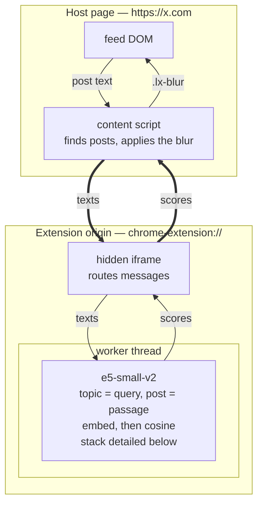
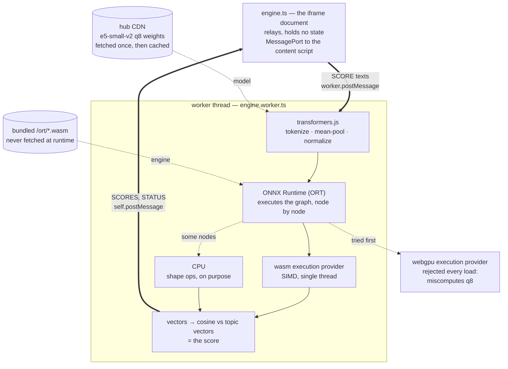

# How it works

Three layers, each for one reason. The **content script** lives inside the page,
so it is the only part that can read the feed or blur anything. The **iframe**
exists because a content script cannot spawn an extension-origin worker, but a
document already on that origin can. The **worker** is a separate thread, so
scoring never blocks scrolling.

The iframe never sees the page: strings go in, scores come out. That boundary is
what keeps post text on your device, and it is why the model layer knows nothing
about X.

## What the model does

Lensing does not train a classifier on your topics. It uses **e5-small-v2**, a
text _embedding_ model from Microsoft ([E5 paper](2212.03533v2.pdf); v2 is
a later release by the same authors, using the same method). An embedding
turns text into a vector, a fixed list of 384 numbers, so that texts about the
same thing end up close together.

Scoring a post takes three steps:

1. The topic line becomes `query: tech, software, ai`, and the post becomes
   `passage: <text>`.
2. The same model turns both into vectors.
3. The score is the cosine between the two vectors: how closely they point the
   same way. With several topic lines, a post keeps its best score.

**Why no training is needed.** E5 learned from a very large set of text pairs
that naturally belong together on the web: a Reddit post and its comment, a
StackExchange question and its answer, a title and its article. Training pulled
each pair's vectors together and pushed apart the other pairs in the same batch.
A short topic against a longer post has the same shape as a question against its
answer, so the model can already match them. The paper handles zero-shot
classification the same way: it embeds the label and the input, then picks the
closest.

**Why the prefixes matter.** One model encodes both sides. `query:` and
`passage:` tell it which side of the pair a text is on, because a three-word
topic and a paragraph of post are different kinds of text. The model was trained
with these tags, and its scores get worse without them.

**Why scores sit in a narrow band.** Cosine can run from −1 to 1, but that is not
how e5 uses the range. During training, every similarity was divided by a
temperature of 0.01. The model was rewarded for ranking the right passage first,
not for spreading scores out. As a result, almost any English text scores well
above zero against almost any topic, and on-topic and off-topic posts are only a
few hundredths apart. That is why strictness is a step on a measured scale rather
than a raw cosine, and why this model's scores mean nothing to a different model.

**What it cannot do.**

- **Read other languages.** It was trained and evaluated on English. Text in
  another language still gets a score, but that score is noise. Lensing checks a
  post's language before trusting its score.
- **Match exact strings reliably.** The paper notes that embedding models still
  trail keyword search when a match depends on exact wording or a niche domain. A
  topic that is only a product name or a ticker matches less reliably than plain
  words that describe the subject.
- **See images.** It reads words only.

## Inside the worker

"Embed" is four pieces of machinery, and the console lines on a cold start come
from three different ones — so it is worth knowing which is which. The thick
edges are the same `texts` / `scores` pair the first diagram draws, seen from the
other side of the worker boundary.

The model produces one vector for each token, where a token is a word or part of
a word. transformers.js averages those vectors into one vector for the whole
text; this is the **mean pool**. E5 was trained with that averaging, so a
different pooling method would produce vectors the model never learned. The
result is then scaled to length 1, which makes the cosine a plain dot product.

**ONNX** is the model's file format — graph plus weights, framework-independent.
**ORT** is Microsoft's engine that executes it, and an **execution provider** is a
backend ORT can hand an operation to. Assignment is per operation, not per model:
ORT deliberately keeps shape ops on CPU because moving them costs more than they
save. That is all its `VerifyEachNodeIsAssignedToAnEp` line means, which is why
the runtime is configured to log errors only.

The two supply lines are deliberately different. **Weights** come from the hub CDN
on first load and live in the browser cache after that. The **runtime WASM** is
bundled in the extension and never fetched — remote WASM is reviewed as remote
code execution, and that is not a review this extension needs to pass.

WebGPU is tried first on every load and rejected on every load: ORT's WebGPU
backend misreads the q8 weights and returns confident nonsense rather than
failing, so the self-check probe is the only thing standing between that and a
feed blurred at random. `wasm` is the steady state.

## Tuning it yourself

The model itself never changes. You do not retrain it, and no weights move.
Every control except thumbs changes one of two things:

- **The query vector:** what "on topic" means.
- **The threshold:** how close a post has to be to count.

**Topic words change the query.** Each topic line is embedded as one `query:`.
It is the only text you write, so it has the largest effect. E5 learned to match
a question to its answer, so it does best with words a matching post would
actually use:

- Use two to five concrete words, not a category name or a sentence. Filler such
  as "posts about" gets matched too.
- Put separate interests on separate lines. A post keeps its best score across
  lines, so it only has to match one of them.

**Strictness changes the threshold.** A post is shown when its score reaches the
threshold. e5 packs all scores into a narrow band (see above), so a slider that
moved the cosine evenly would do nothing for half its travel. Each of the 11
steps is a threshold measured to hide about another tenth of a typical feed.
Higher steps hide more noise, and also more of what you wanted.

**The peek strip marks the close calls.** Just below the threshold is a thin
strip where a post could still be wanted. Posts there stay blurred, but their
first few words remain readable, so you can judge them without revealing them.
The strip's width is fixed in score units, so it moves with the threshold.

**Thumbs fix posts that are almost the same as one you rated.** This is off
until you turn on _Learn from my thumbs_. A thumb never changes your topic: the
score always comes from your topic words alone, so "shown means above the
threshold" stays true. Instead, the rated post's vector is kept, and a new post
that is nearly identical to it (a repost, a quote, the same story told the same
way) follows your rating: shown if you liked the original, blurred if you
disliked it. Everything else is judged by its score, as if you had never rated
anything.

"Nearly identical" is a high bar on purpose. Two unrelated posts already look
fairly alike to this model, so the bar sits where, on a labelled sample, no
post was ever that close to one with the opposite label. Most ratings therefore
change nothing until a near-copy shows up. That is the trade: a thumb can never
push a good post out of view by accident.

An earlier version moved the topic itself toward liked posts and away from
disliked ones. It shifted every score on that topic, including posts that had
nothing to do with the rated one, and measured no better than not moving it.

**Vectors only make sense to the model that made them.** A model update
therefore deletes every rating. The post text is already gone, so nothing
can be embedded again.

To see all of this at work, turn on _Show each post's score_ in the popup. Each
post then shows the score it got and the score it needed.

## What a thumb changes

A thumb belongs to **one topic line: the one the post matched best**. It only
affects new posts that match that same line, so a thumb on one topic never
changes another. Rate the same post again and it un-rates; rate it the other way
and it flips.

**No individual word is picked out.** The post's text goes to the worker as one
string and comes back as one vector, and new posts are compared with that
vector as a whole. There is no keyword extraction to inspect.

Two things follow. Rating a post whose meaning lives in its image matches other
posts on a caption that was never the point, because the model reads words only.
And a rating belongs to one line: rewrite that line and its ratings go with it,
while the other lines keep theirs.

Full reasoning in [`wiki-llm/architecture.md`](../wiki-llm/architecture.md), model
detail in [`wiki-llm/model.md`](../wiki-llm/model.md), terms in
[`wiki-llm/glossary.md`](../wiki-llm/glossary.md), and the model's origin in the
[E5 paper](2212.03533v2.pdf).
