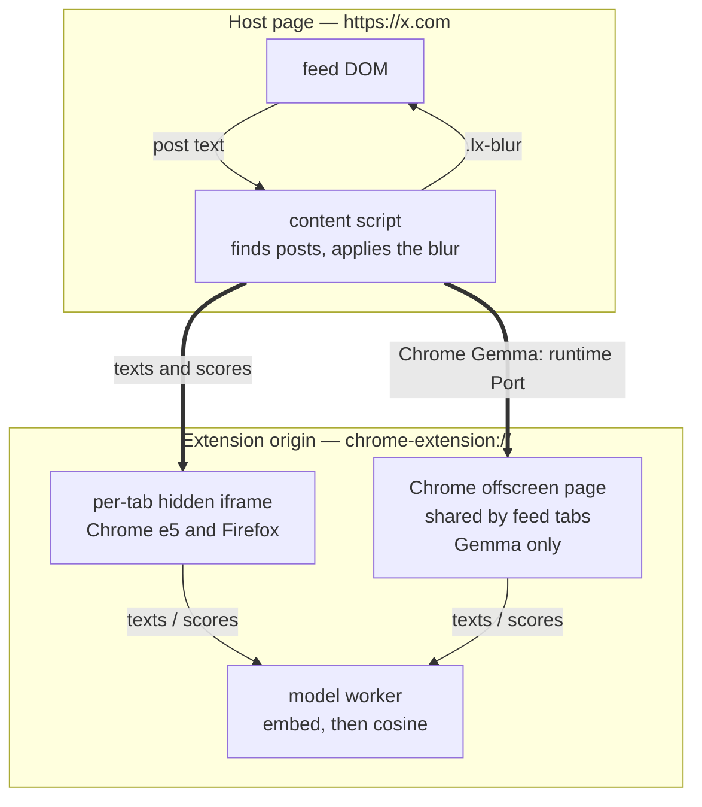
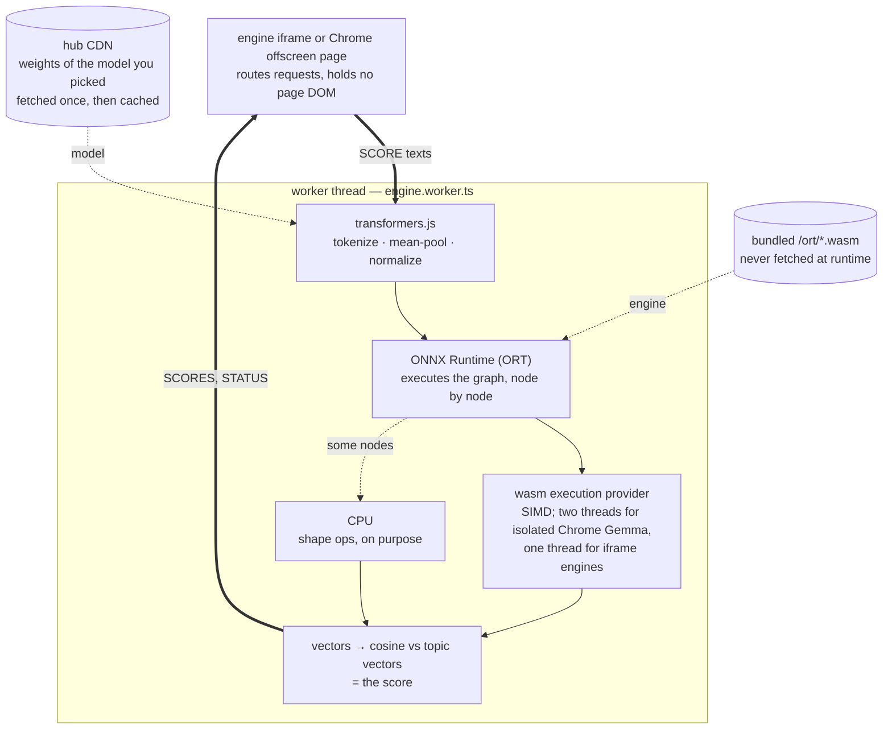

# How it works

uFeed can filter your feed by topics, a keyword blacklist, or both. Topic filtering
blurs posts that do not match your subjects. Blacklist matches blur even when they
fit a topic; with only a blacklist, posts without a match stay visible.

## Why it is built this way

Four choices shape everything else. Each one gives something up.

- **Choose what to keep, block or both.** Topic filtering keeps posts about your
  chosen subjects and blurs the rest. A keyword blacklist blurs posts containing
  listed words or phrases. It works on its own or alongside topics; with only a
  blacklist, posts without a match stay visible.
- **Blur, never delete.** Every blurred post is one click (or Enter, from the
  keyboard) from readable, so a wrong call costs a click, not a missed post.
- **An embedding model, not a chat model.** uFeed turns text into numbers and
  compares them. It does not reason about a post. That is what keeps the model
  small (33 MB by default), lets it run in your browser, and makes it give the same
  answer every time for the same post. The cost: it cannot weigh sarcasm or "this
  topic, but not the hype" the way a large cloud model can.
- **Nothing to trust.** There is no server, so there is no cloud mode and no
  account. The models are small enough that private is the only mode, not a slower
  option behind a setting.

The rest of this page shows the machinery.

## Where it runs

The **content script** lives inside the page, so it is the only part that can read
the feed or blur anything. A **worker** does the scoring off the page's main
thread. Chrome uses a shared offscreen extension page for the multilingual model,
so feed tabs reuse one model session and its isolated worker can use two WASM
threads. Chrome's default English model and both Firefox models use the per-tab
hidden iframe and a single WASM thread. The iframe is a document on the extension
origin, which lets it start a worker without giving that worker access to the host
page.

Neither engine document sees the host page: strings go in, scores come out. The
content script reads and blurs posts; model work stays in an extension worker.
That boundary keeps post text on your device and the model layer independent of X.

## What the model does

uFeed does not train a classifier on your topics. It uses a text _embedding_
model, and you pick which one under _Model_ in the popup:

| Model                         | Reads          | Download | Work per post         |
| :---------------------------- | :------------- | :------- | :-------------------- |
| **e5-small-v2** (the default) | English only   | 33 MB    | small                 |
| **EmbeddingGemma** (opt-in)   | Every language | 197 MB   | about nine times more |

e5-small-v2 comes from Microsoft ([E5 paper](https://arxiv.org/abs/2212.03533); v2 is
a later release by the same authors, using the same method). EmbeddingGemma is
Google's 300-million-parameter retrieval model, run at 4-bit precision. An
embedding turns text into a vector, a fixed list of numbers (384 for e5, 768 for
EmbeddingGemma), so that texts about the same thing end up close together.

Scoring a post takes three steps:

1. Each side gets a tag saying which it is. For e5, the topic line becomes
   `query: tech, software, ai` and the post becomes `passage: <text>`;
   EmbeddingGemma has its own tags for the same job.
2. The same model turns both into vectors.
3. The score is the cosine between the two vectors: how closely they point the
   same way. With several topic lines, a post keeps its best score.

**Why no training is needed.** E5 learned from a very large set of text pairs
that naturally belong together on the web: a Reddit post and its comment, a
StackExchange question and its answer, a title and its article. Training pulled
each pair's vectors together and pushed apart the other pairs in the same batch.
A short topic against a longer post has the same shape as a question against its
answer, so the model can already match them. The paper handles zero-shot
classification the same way: it embeds the label and the input, then picks the
closest.
EmbeddingGemma is a retrieval model too, so the same argument holds for it.

**Why the prefixes matter.** One model encodes both sides. `query:` and
`passage:` tell it which side of the pair a text is on, because a three-word
topic and a paragraph of post are different kinds of text. The model was trained
with these tags, and its scores get worse without them. Each model has its own
tags, and uFeed uses the right ones for the model you picked.

**Why scores sit in a narrow band.** Cosine can run from −1 to 1, but that is not
how e5 uses the range. During training, every similarity was divided by a
temperature of 0.01. The model was rewarded for ranking the right passage first,
not for spreading scores out. As a result, almost any English text scores well
above zero against almost any topic, and on-topic and off-topic posts are only a
few hundredths apart. That is why strictness is a step on a measured scale rather
than a raw cosine, and why this model's scores mean nothing to a different model.
EmbeddingGemma lands on a different, lower range altogether, so each model has its
own scale.

**What it cannot do.**

- **Read other languages, on the default model.** e5 was trained and evaluated on
  English. Text in another language still gets a score, but that score is noise.
  uFeed checks a post's language before trusting its score. EmbeddingGemma reads
  every language, so it has no such check and the popup's language option switches
  itself off.
- **Match exact strings reliably.** The paper notes that embedding models still
  trail keyword search when a match depends on exact wording or a niche domain. A
  topic that is only a product name or a ticker matches less reliably than plain
  words that describe the subject.
- **See images.** It reads words only.

## Inside the worker

"Embed" is four pieces of machinery, and the console lines on a cold start come
from three different ones — so it is worth knowing which is which. The thick
edges are the same `texts` / `scores` pair the first diagram draws, seen from the
other side of the worker boundary.

The model produces one vector for each token, where a token is a word or part of
a word. transformers.js averages those vectors into one vector for the whole
text; this is the **mean pool**. E5 was trained with that averaging, so a
different pooling method would produce vectors the model never learned.
EmbeddingGemma is the exception: its graph pools inside itself and returns one
vector already, so uFeed reads that output rather than averaging. Either way
the result is then scaled to length 1, which makes the cosine a plain dot product.

**ONNX** is the model's file format — graph plus weights, framework-independent.
**ORT** is Microsoft's engine that executes it, and an **execution provider** is a
backend ORT can hand an operation to. Assignment is per operation, not per model:
ORT deliberately keeps shape ops on CPU because moving them costs more than they
save. That is all its `VerifyEachNodeIsAssignedToAnEp` line means, which is why
the runtime is configured to log errors only.

The two supply lines are deliberately different. **Weights** come from the hub CDN
on first load, only for the model you picked, and live in the browser cache after
that. (EmbeddingGemma's come from the `onnx-community` mirror, because Google's own
repository is gated.) The **runtime WASM** is
bundled in the extension and never fetched — remote WASM is reviewed as remote
code execution, and that is not a review this extension needs to pass.

The model runs on the CPU, through WASM. WebGPU was tried and dropped: ORT's
WebGPU backend misreads the quantized weights of both models and returns confident
nonsense rather than failing. A self-check probe still runs on every load, so a runtime that
miscomputes on some machine is refused rather than trusted, and the feed stays
unblurred.

## While a post is being judged

Scoring takes a moment, and longer on the multilingual model. From the instant a
post is found until its verdict lands, it sits under a heavier blur with
"Classifying…" in the middle, so you never read a post and then watch it blur under
you. The blur lifts when the verdict does, whichever way it went, and clicks still
reach the post.

Two things end it early. If nothing answers for ten seconds, the hold lifts on its
own and the post shows. And while a model is still downloading for the first time,
nothing is held at all: the feed shows as normal rather than waiting on a download.

## Tuning it yourself

The model itself never changes. You do not retrain it, and no weights move.
Every control except thumbs and the model picker changes one of two things:

- **The query vector:** what "on topic" means.
- **The threshold:** how close a post has to be to count.

**The model picker swaps the whole engine.** Choosing the other model starts a
fresh engine and scores the page again. Your topics, strictness step and toggles
carry over, and each model keeps its own thumb ratings.

**Topic words change the query.** Each topic line is embedded as one `query:`.
It is the only text you write, so it has the largest effect. E5 learned to match
a question to its answer, so it does best with words a matching post would
actually use:

- Use two to five concrete words, not a category name or a sentence. Filler such
  as "posts about" gets matched too.
- Put separate interests on separate lines. A post keeps its best score across
  lines, so it only has to match one of them.
- With EmbeddingGemma, phrasing matters much less and one word is enough. Language
  still matters: write topics in the language of the posts you want to keep, one
  line each if your feed mixes languages.

**Strictness changes the threshold.** A post is shown when its score reaches the
threshold. e5 packs all scores into a narrow band (see above), so a slider that
moved the cosine evenly would do nothing for half its travel. Each of the 11
steps is a threshold measured, on one sample feed, to hide about another tenth
of it. Your feed will differ. Each model has its own 11 steps, set so a step
spends about the same share of the feed on either, which is why your step survives
a switch. EmbeddingGemma's were derived the same way but not measured as
carefully, so treat them as approximate.
Higher steps hide more noise, and also more of what you wanted.

**The peek strip marks the close calls.** Just below the threshold is a thin
strip where a post could still be wanted. Posts there stay blurred, but their
first few words remain readable, so you can judge them without revealing them.
The strip's width is fixed in score units, so it moves with the threshold.

**Thumbs fix posts that are almost the same as one you rated.** This is off
until you turn on _Learn from my thumbs_. A thumb never changes your topic: the
score always comes from your topic words alone, so "shown means above the
threshold" stays true. Instead, the rated post's vector is kept, and a new post
that is nearly identical to it (a repost, a quote, the same story told the same
way) follows your rating: shown if you marked the original on topic, blurred
if you marked it off topic. Everything else is judged by its score, as if you had never rated
anything.

"Nearly identical" is a high bar on purpose. Two unrelated posts already look
fairly alike to this model, so the bar sits where, on a labelled sample, no
post was ever that close to one with the opposite label. Most ratings therefore
change nothing until a near-copy shows up. That is the trade: a thumb can never
push a good post out of view by accident.

An earlier version moved the topic itself toward posts marked on topic and away
from posts marked off topic. It shifted every score on that topic, including posts that had
nothing to do with the rated one, and measured no better than not moving it.

**Vectors only make sense to the model that made them.** Ratings are therefore
kept per model: each model reads only its own, switching to the other one loses
nothing, and switching back restores them. If a model is ever replaced, the
ratings made with it are dropped, because the post text is already gone and
nothing can be embedded again.

A small green badge in the bottom-left corner counts the posts uFeed is hiding
on the page, and clicking it opens the popup.

To see all of this at work, turn on _Show each post's score_ in the popup. Each
post then shows the score it got and the score it needed. Hover a post to see
its score against every topic line, and a post decided by a thumb says
"marked on topic" or "marked off topic".

## What a thumb changes

A thumb is stored under **the topic line the post matched best**, and it applies
to any near-copy of that post, whichever line the copy lands on. Off-topic posts
score almost the same on every line, so the "best" line is close to a coin flip
for them. A thumb never changes any topic's scores, so it cannot shift how other
posts are judged. Rate the same post again and it un-rates; rate it the other
way and it flips.

**No individual word is picked out.** The post's text goes to the worker as one
string and comes back as one vector, and new posts are compared with that
vector as a whole. There is no keyword extraction to inspect.

Two things follow. Rating a post whose meaning lives in its image matches other
posts on a caption that was never the point, because the model reads words only.
And a rating is stored with one line: rewrite that line and its ratings go with
it, while the other lines keep theirs.

Full reasoning in [`wiki-llm/architecture.md`](../wiki-llm/architecture.md), model
detail in [`wiki-llm/model.md`](../wiki-llm/model.md), terms in
[`wiki-llm/glossary.md`](../wiki-llm/glossary.md). The default model's origin is the
[E5 paper](https://arxiv.org/abs/2212.03533); the multilingual one is
[EmbeddingGemma](https://huggingface.co/onnx-community/embeddinggemma-300m-ONNX).
